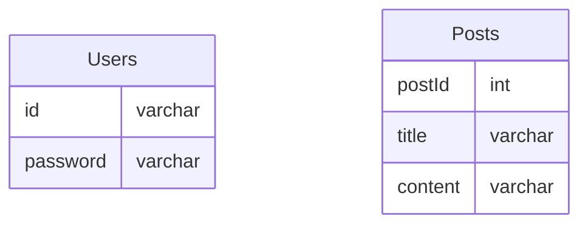

### Toy Project

#### ERD (project) : 

#### Skills : <span style='color:gray'>Python, django, DRF(django rest framework)</span>

### Example :
#### How to run the server :
```sh
$ python3 ./manage.py runserver {ip:port}
```