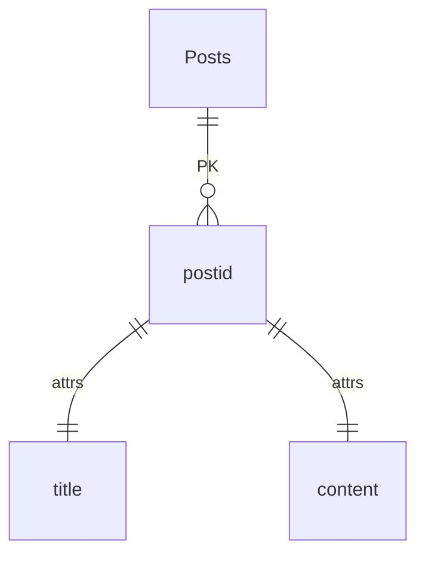

### Toy Project

#### ERD (project) : 

#### Skills : <span style='color:gray'>Python, django, DRF(django rest framework)</span>


##### Optionally need to use decoding : <span style='color:red'>"euc-kr"</span>


### Example :
#### How to run the server :
```sh
$ python3 ./manage.py runserver
```

#### Create(POST) :
```sh
$ curl -X POST http://{urls}:8000/app/posts/ \
    -d '{"title":"make a title", "content":"make a content"}' \
    -H "Content-Type: application/json;charset=euc-kr" \
```

#### Read(GET) :
```sh
# Read a single line
$ curl -X GET http://{urls}:8000/app/posts/{postid}

# Read all list
$ curl -X GET http://{urls}:8000/app/posts/list
```


#### Update(PUT) :
```sh
$ curl -X PUT http://{urls}:8000/app/posts/{postid} \
    -d '{"title":"a title what you change", "content":"a content what you change"}' \
    -H "Content-Type: application/json;charset=euc-kr" \
```

#### Delete(DELETE) :
```sh
$ curl -X DELETE http://{urls}:8000/app/posts/{postid}
```